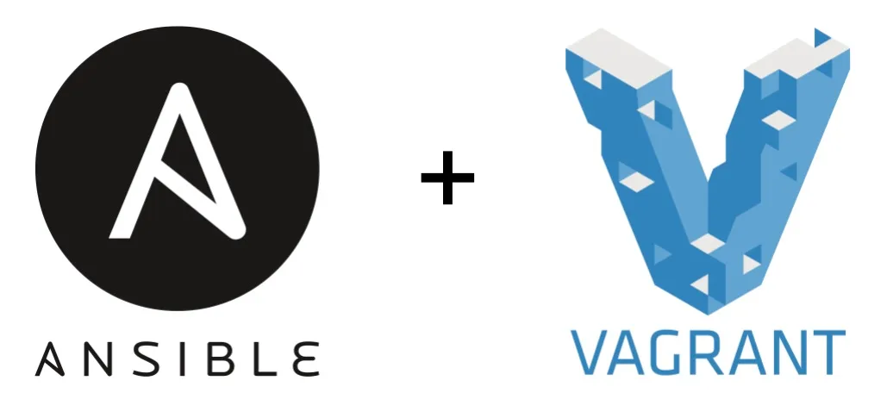

<!-- 
*** Thanks for checking out the Best-README-Template. If you have a suggestion
*** that would make this better, please fork the repo and create a pull request
*** or simply open an issue with the tag "enhancement".
*** Don't forget to give the project a star!
*** Thanks again! Now go create something AMAZING! :D
-->
<!-- Here's a blank template to get started: To avoid retyping too much info. Do a search and replace with your text editor for the following: `Kobeep`, `linux-vm-provisioning-examples`, `twitter_handle`, `linkedin_username`, `email_client`, `email`, `project_title`, `project_description` -->

<!-- PROJECT SHIELDS -->
<!--
*** I'm using markdown "reference style" links for readability.
*** Reference links are enclosed in brackets [ ] instead of parentheses ( ).
*** See the bottom of this document for the declaration of the reference variables
*** for contributors-url, forks-url, etc. This is an optional, concise syntax you may use.
*** https://www.markdownguide.org/basic-syntax/#reference-style-links -->

[![Contributors][contributors-shield]][contributors-url]
[![Forks][forks-shield]][forks-url]
[![Stargazers][stars-shield]][stars-url]
[![Issues][issues-shield]][issues-url]
[![MIT License][license-shield]][license-url]
[![LinkedIn][linkedin-shield]][linkedin-url]

<!-- PROJECT LOGO -->
<br />
<div align="center">
  <a href="https://github.com/Kobeep/linux-vm-provisioning-examples">
    
  </a>

<h3 align="center">linux-vm-provisioning-examples</h3>

  
</div>

<!-- TABLE OF CONTENTS -->
<details>
  <summary>Table of Contents</summary>
  <ol>
    <li>
      <a href="#about-the-project">About The Project</a>
      <ul>
        <li><a href="#built-with">Built With</a></li>
      </ul>
    </li>
    <li>
      <a href="#getting-started">Getting Started</a>
      <ul>
        <li><a href="#prerequisites">Prerequisites</a></li>
        <li><a href="#installation">Installation</a></li>
      </ul>
    </li>
    <li><a href="#usage">Usage</a></li>
    <li><a href="#roadmap">Roadmap</a></li>
    <li><a href="#contributing">Contributing</a></li>
    <li><a href="#license">License</a></li>
    <li><a href="#contact">Contact</a></li>
    <li><a href="#acknowledgments">Acknowledgments</a></li>
  </ol>
</details>

<!-- ABOUT THE PROJECT -->
## About The Project

The project demonstrates two approaches to automatically creating and configuring a Linux environment based on QEMU/KVM virtual machines. You can choose one of them:

**Approach 1 (Vagrant Provisioning):** Utilizes Vagrant to launch machines and execute configuration scripts within them.

**Approach 2 (Ansible):** Utilizes Vagrant to launch machines, but Ansible is used to define the target state of the infrastructure and perform automatic configuration.


### Built With

* [![Ansible][ansible.com]][Ansible-url]
* [![React][React.js]][React-url]
* [![Vue][Vue.js]][Vue-url]
* [![Angular][Angular.io]][Angular-url]
* [![Svelte][Svelte.dev]][Svelte-url]
* [![Laravel][Laravel.com]][Laravel-url]
* [![Bootstrap][Bootstrap.com]][Bootstrap-url]
* [![JQuery][JQuery.com]][JQuery-url]


<!-- GETTING STARTED -->
## Getting Started

### Installing libvirt

***Fedora***

1. Update the package first:
   
   ```sh
   sudo dnf update
   ```

2. Install the required packages:
   
    ```sh
    sudo dnf install @virtualization
    sudo dnf install libvirt libvirt-devel qemu-kvm
    ```

3. Start and enable the libvirtd service:

    ```sh
    sudo systemctl start libvirtd
    sudo systemctl enable libvirtd
    ```

***Ubuntu***

1. Update the package first:
   
   ```sh
   sudo apt update
   ```

2. Install the required packages:
   
    ```sh
    sudo apt install libvirt-bin qemu-kvm
    ```

3. Start and enable the libvirtd service:

    ```sh
    sudo systemctl start libvirtd
    sudo systemctl enable libvirtd
    ```

***Red Hat***

1. Update the package first:
   
   ```sh
   sudo yum update
   ```

2. Install the required packages:
   
    ```sh
    sudo yum install libvirt libvirt-devel qemu-kvm

    ```

3. Start and enable the libvirtd service:

    ```sh
    sudo systemctl start libvirtd
    sudo systemctl enable libvirtd
    ```

### Installing Vagrant

***Fedora***

1. Add the HashiCorp repository:
   
   ```sh
   sudo dnf config-manager --add-repo https://rpm.releases.hashicorp.com/fedora/hashicorp.repo
   ```

2. Install Vagrant:
   
    ```sh
    sudo dnf install vagrant
    ```

***Ubuntu***

1. Download the Vagrant package:
   
   ```sh
   curl -O https://releases.hashicorp.com/vagrant/2.3.4/vagrant_2.3.4_x86_64.deb
   ```

2. Install the package:
   
    ```sh
    sudo apt install ./vagrant_2.3.4_x86_64.deb
    ```

***Red Hat***

1. Add the HashiCorp repository:
   
   ```sh
   sudo yum-config-manager --add-repo https://rpm.releases.hashicorp.com/RHEL/hashicorp.repo
   ```

2. Install Vagrant:
   
    ```sh
    sudo yum install vagrant
    ```

<!-- USAGE EXAMPLES -->
## Usage
1. Cloning repository:

    ```sh
    git clone 
    ```

<!-- CONTRIBUTING -->
## Contributing

Contributions are what make the open source community such an amazing place to learn, inspire, and create. Any contributions you make are **greatly appreciated**.

If you have a suggestion that would make this better, please fork the repo and create a pull request. You can also simply open an issue with the tag "enhancement".
Don't forget to give the project a star! Thanks again!

1. Fork the Project
2. Create your Feature Branch (`git checkout -b feature/AmazingFeature`)
3. Commit your Changes (`git commit -m 'Add some AmazingFeature'`)
4. Push to the Branch (`git push origin feature/AmazingFeature`)
5. Open a Pull Request


<!-- LICENSE -->
## License

Distributed under the MIT License. See `LICENSE.txt` for more information.


<!-- CONTACT -->
## Contact

Project Link: [https://github.com/Kobeep/linux-vm-provisioning-examples](https://github.com/Kobeep/linux-vm-provisioning-examples)


<!-- ACKNOWLEDGMENTS -->
## Acknowledgments

* []()
* []()
* []()


<!-- MARKDOWN LINKS & IMAGES -->
<!-- https://www.markdownguide.org/basic-syntax/#reference-style-links -->
[contributors-shield]: https://img.shields.io/github/contributors/Kobeep/linux-vm-provisioning-examples.svg?style=for-the-badge
[contributors-url]: https://github.com/Kobeep/linux-vm-provisioning-examples/graphs/contributors
[forks-shield]: https://img.shields.io/github/forks/Kobeep/linux-vm-provisioning-examples.svg?style=for-the-badge
[forks-url]: https://github.com/Kobeep/linux-vm-provisioning-examples/network/members
[stars-shield]: https://img.shields.io/github/stars/Kobeep/linux-vm-provisioning-examples.svg?style=for-the-badge
[stars-url]: https://github.com/Kobeep/linux-vm-provisioning-examples/stargazers
[issues-shield]: https://img.shields.io/github/issues/Kobeep/linux-vm-provisioning-examples.svg?style=for-the-badge
[issues-url]: https://github.com/Kobeep/linux-vm-provisioning-examples/issues
[license-shield]: https://img.shields.io/github/license/Kobeep/linux-vm-provisioning-examples.svg?style=for-the-badge
[license-url]: https://github.com/Kobeep/linux-vm-provisioning-examples/blob/master/LICENSE.txt
[linkedin-shield]: https://img.shields.io/badge/-LinkedIn-black.svg?style=for-the-badge&logo=linkedin&colorB=555
[linkedin-url]: https://linkedin.com/in/linkedin_username
[product-screenshot]: images/screenshot.png
[React.js]: https://img.shields.io/badge/React-20232A?style=for-the-badge&logo=react&logoColor=61DAFB
[React-url]: https://reactjs.org/
[Vue.js]: https://img.shields.io/badge/Vue.js-35495E?style=for-the-badge&logo=vuedotjs&logoColor=4FC08D
[Vue-url]: https://vuejs.org/
[Angular.io]: https://img.shields.io/badge/Angular-DD0031?style=for-the-badge&logo=angular&logoColor=white
[Angular-url]: https://angular.io/
[Svelte.dev]: https://img.shields.io/badge/Svelte-4A4A55?style=for-the-badge&logo=svelte&logoColor=FF3E00
[Svelte-url]: https://svelte.dev/
[Laravel.com]: https://img.shields.io/badge/Laravel-FF2D20?style=for-the-badge&logo=laravel&logoColor=white
[Laravel-url]: https://laravel.com
[Bootstrap.com]: https://img.shields.io/badge/Bootstrap-563D7C?style=for-the-badge&logo=bootstrap&logoColor=white
[Bootstrap-url]: https://getbootstrap.com
[JQuery.com]: https://img.shields.io/badge/jQuery-0769AD?style=for-the-badge&logo=jquery&logoColor=white
[JQuery-url]: https://jquery.com
